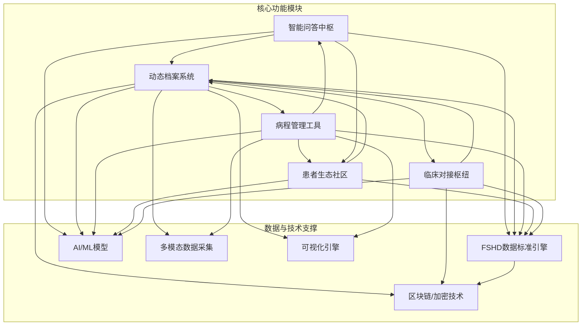
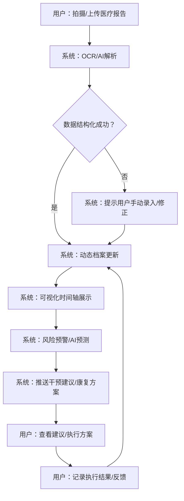
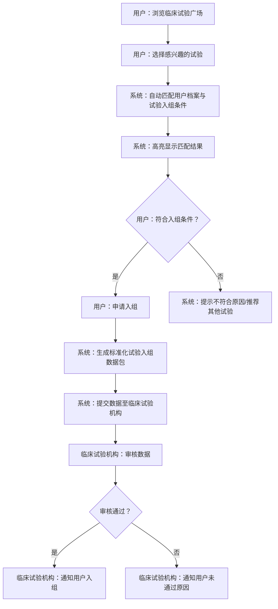
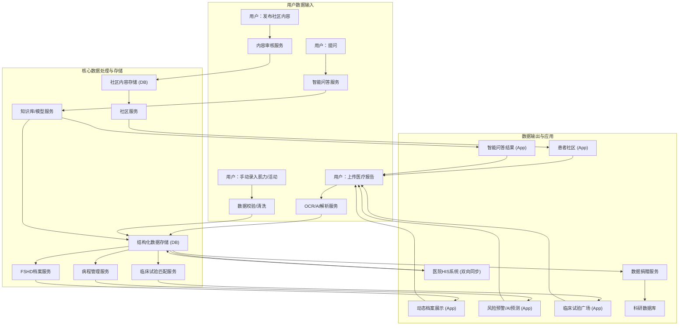

# FSHD-openrd产品需求文档

## 1. 产品概述

### 1.1 产品名称与定位

*   **产品名称:** FSHD-openrd
*   **产品定位:** 一款专为FSHD（面肩肱型肌营养不良症）患者设计的移动端智能管理平台，旨在通过数据驱动、智能分析和社区互助，赋能患者自我管理，优化医疗资源对接，加速科研进展。

### 1.2 产品愿景与目标

*   **产品愿景:** 成为FSHD患者管理病程、获取知识、寻求支持和参与科研的首选平台，最终提升患者生活质量并推动FSHD治疗的发展。
*   **产品目标:**
    *   提升FSHD患者对疾病的认知和自我管理能力。
    *   建立标准化、动态更新的FSHD患者档案，为个性化治疗和科研提供数据支持。
    *   构建活跃的FSHD患者社区，促进经验分享和互助。
    *   优化临床试验入组流程，加速FSHD新药研发。
    *   实现与医疗机构的数据互通，提升诊疗效率。

### 1.3 产品使用终端

*   **主要终端:** 移动端App (iOS & Android)

### 1.4 核心价值主张

*   **个性化管理:** 基于多模态数据，提供定制化的病程管理、康复建议和用药指导。
*   **知识赋能:** 整合权威FSHD知识库和临床路径，提供精准问答服务。
*   **社区支持:** 搭建分层互助社区，连接患者、家属与专业人士。
*   **科研加速:** 标准化数据采集与共享，助力FSHD药物研发和临床试验。
*   **医疗协同:** 打通患者与医疗机构的数据壁垒，提升诊疗效率。

### 1.5 目标用户群体分析

*   **FSHD患者:** 核心用户，需要自我管理工具、疾病知识、康复指导和情感支持。
*   **患者家属/照护者:** 需要了解疾病、学习照护知识、获取支持资源。
*   **FSHD研究者/医生:** 需要标准化的患者数据、临床试验招募和科研合作。
*   **康复师/理疗师:** 需要患者日常数据、康复效果追踪和个性化康复方案制定。

### 1.6 市场需求与竞品简析

*   **市场需求:** FSHD作为罕见病，患者面临信息获取难、医疗资源分散、自我管理缺乏工具、科研参与门槛高等痛点。市场急需一款整合信息、数据、社区和医疗资源的综合性平台。
*   **竞品简析:**
    *   **现有医疗App:** 多为通用型，缺乏FSHD特异性功能和深度数据整合。
    *   **罕见病社区:** 多为论坛或社交媒体群组，缺乏结构化数据管理和智能分析能力。
    *   **科研数据平台:** 多为机构内部使用，患者参与度低，数据采集不便。
*   **FSHD-openrd优势:** 专注于FSHD领域，深度整合多模态数据，结合AI智能分析，提供从患者自我管理到临床科研对接的全链路解决方案，形成差异化竞争优势。

## 2. 功能规格

### 2.1 功能详述

#### 2.1.1 智能问答中枢

| 功能ID | 功能名称 | 功能描述 | 优先级 |
|--------|---------|---------|--------|
| F-QNA_001 | FSHD专业知识库 | 构建覆盖FSHD分型鉴别、症状管理、遗传咨询、康复训练、用药指导等核心知识的结构化知识库。内容由医学专家审核，确保权威性和准确性。 | P0 |
| F-QNA_002 | 问题-档案联动 | 用户提问时，系统自动调取用户动态档案中的相关数据（如基因类型、肌力评分、病程阶段、地域等），结合知识库内容生成个性化、精准的答案。 | P0 |
| F-QNA_003 | 地域化资源推荐 | 根据用户注册地或当前位置，智能推荐就近的FSHD诊疗中心、康复机构、临床试验点等医疗资源。 | P0 |
| F-QNA_004 | 临床路径指引 | 嵌入30+三甲医院FSHD临床路径，为用户提供标准化的诊疗流程指引，包括检查项目、治疗方案、随访周期等。 | P0 |

#### 2.1.2 动态档案系统

| 功能ID | 功能名称 | 功能描述 | 优先级 |
|--------|---------|---------|--------|
| F-ARCHIVE_001 | 多模态数据采集 | 支持用户通过拍照、上传文件等方式，利用OCR技术解析基因检测报告、MRI影像、血检报告等医疗文档，自动提取关键数据。支持手动录入肌力评分（0-5级滑动条）、楼梯测试计时（手机陀螺仪辅助防抖）、日常活动打卡（语音录入、文字输入）。 | P0 |
| F-ARCHIVE_002 | 可视化时间轴 | 以时间轴形式展示患者病程发展、肌力变化趋势、影像对比、用药记录、重要检查结果等关键数据，支持多维度数据叠加展示。 | P0 |
| F-ARCHIVE_003 | FSHD临床护照 | 生成唯一的、标准化的FSHD临床护照，加密存储患者基因数据、历次评估摘要、关键检查结果等核心医疗档案。支持一键导出符合FDA/国家药监局标准的PDF文档，便于临床试验入组和多中心诊疗。 | P0 |
| F-ARCHIVE_004 | 风险预警看板 | 基于预设的临床指标（如连续3次楼梯时间≥15秒、肌力下降幅度），自动生成康复介入建议包、功能衰退预警等，并在时间轴上高亮显示风险节点。 | P0 |

#### 2.1.3 病程管理工具

| 功能ID | 功能名称 | 功能描述 | 优先级 |
|--------|---------|---------|--------|
| F-MANAGE_001 | 肌肉力量评估 | 提供肌群力量雷达图，实时对比同年龄段FSHD患者的肌群数据，帮助用户了解自身肌力水平。 | P0 |
| F-MANAGE_002 | 异常活动预警 | 关联手机健康数据（步数、爬楼次数），结合用户日常活动日志，自动识别异常情况（如周步数下降30%），触发“功能衰退预警”。 | P0 |
| F-MANAGE_003 | AI病程预测 | 基于用户的基因类型、初诊年龄、当前肌力、影像数据等，通过AI模型预测未来3/5年病程发展趋势（如出现足下垂的概率），并联动康复科生成定制化干预计划。 | P0 |
| F-MANAGE_004 | 用药安全管理 | 对接上传的血检报告，自动分析肝功能、肾功能等指标，预警非甾体抗炎药等药物的不良反应风险（如ALT＞40U/L时提示“建议复查”）。 | P0 |

#### 2.1.4 患者生态社区

| 功能ID | 功能名称 | 功能描述 | 优先级 |
|--------|---------|---------|--------|
| F-COMMUNITY_001 | 分层交流专区 | 设立“新手村”（初诊1年内患者）、“肌力加油站”（按肌群分组）、“临床试验广场”等针对性社区，促进同阶段患者间的交流。 | P0 |
| F-COMMUNITY_002 | 康复经验分享 | 提供经康复师认证的居家训练视频库，支持用户上传分享经验。视频播放时支持动作捕捉纠错功能，确保训练动作的准确性。 | P0 |
| F-COMMUNITY_003 | 临床试验广场 | 实时同步全国FSHD临床试验入组条件，用户可查看试验详情，并根据自身档案数据自动匹配，高亮显示符合的筛选标准。 | P0 |
| F-COMMUNITY_004 | 医疗资源地图 | 标注全国32家FSHD诊疗中心、58家康复机构的位置、联系方式、特色服务，并提供挂号捷径（如华西医院“FSHD专病门诊”每周三开放）。 | P0 |
| F-COMMUNITY_005 | 专家咨询通道 | 提供在线图文咨询或电话咨询服务，连接患者与FSHD专科医生，解答专业问题。 | P0 |

#### 2.1.5 临床对接枢纽

| 功能ID | 功能名称 | 功能描述 | 优先级 |
|--------|---------|---------|--------|
| F-CLINICAL_001 | 试验入组加速 | 预设CDISC标准数据模板，用户授权后自动生成「试验入组数据包」，包含基因报告、近1年肌力曲线、MRI影像摘要等，大幅缩短筛查周期。 | P0 |
| F-CLINICAL_002 | 医院数据同步 | 对接医院HIS系统，实现患者随访数据（如年度评估结果）自动同步至个人档案，减少重复录入。 | P0 |
| F-CLINICAL_003 | 数据捐赠机制 | 患者可选择「匿名化数据捐赠」，数据经脱敏处理后汇入中国FSHD队列数据库，支撑本土药物研发和科研项目。 | P0 |

#### 2.1.6 系统基础功能

| 功能ID | 功能名称 | 功能描述 | 优先级 |
|--------|---------|---------|--------|
| F-SYSTEM_001 | 用户注册登录 | 支持手机号、第三方（微信、支付宝）等多种登录方式，确保账户安全。 | P0 |
| F-SYSTEM_002 | 隐私权限管理 | 采用区块链存证数据操作日志，支持“最小必要”授权原则，用户可精细控制数据访问权限（如仅向试验方开放肌力数据）。 | P0 |
| F-SYSTEM_003 | 个性化设置 | 提供大字体模式、语音读屏、高对比度模式等无障碍功能，提升老年患者和视力障碍患者的使用体验。 | P0 |
| F-SYSTEM_004 | 数据安全保障 | 采用医疗级数据加密技术，符合国家及国际隐私保护标准（如HIPAA、GDPR），确保用户数据安全。 | P0 |

### 2.2 功能模块间的关系图

## 3. 用户流程

### 3.1 用户旅程地图

| 阶段 | 用户目标 | 用户行为 | 系统响应 | 痛点/机遇 | 触点 |
|------|----------|----------|----------|-----------|------|
| **初次接触** | 了解FSHD，寻找管理工具 | 下载App，注册登录，浏览首页 | 引导注册，展示核心功能，提供新手引导 | 信息碎片化，不知如何开始 | App Store，肌愈通App |
| **数据录入** | 建立个人健康档案 | 上传基因报告、MRI影像，手动录入肌力、日常活动 | OCR/AI解析，数据结构化，生成时间轴 | 数据分散，录入繁琐，担心隐私 | 动态档案页（P-ARCHIVE），数据录入页（P-DATA_ENTRY） |
| **知识获取** | 解答疑问，获取专业指导 | 在问答中枢提问，浏览知识库 | 智能匹配档案数据，提供个性化答案，推荐相关知识 | 信息不准确，无法获取针对性建议 | 智能问答页（P-QNA） |
| **病程管理** | 追踪病情变化，获取干预建议 | 查看时间轴，进行肌力评估，记录日常活动 | 动态更新数据，生成风险预警，推送康复方案 | 病情进展不明，缺乏有效干预手段 | 动态档案页（P-ARCHIVE），病程管理页（P-MANAGE） |
| **社区互动** | 寻求支持，分享经验 | 加入社区，发帖提问，浏览康复视频 | 提供分层社区，内容审核，动作捕捉纠错 | 孤独感，缺乏同伴支持，康复动作不规范 | 患者社区页（P-COMMUNITY），康复经验分享页（P-REHAB_SHARE） |
| **医疗对接** | 参与临床试验，获取专家咨询 | 浏览临床试验，申请入组，预约专家咨询 | 自动匹配试验，生成入组数据包，提供咨询入口 | 试验信息闭塞，专家资源难寻 | 临床试验广场页（P-TRIAL_SQUARE），专家咨询页（P-EXPERT_CONSULT） |
| **数据捐赠** | 贡献数据，助力科研 | 了解数据捐赠，授权匿名化捐赠 | 提供捐赠说明，数据脱敏处理，反馈捐赠状态 | 担心隐私泄露，不确定捐赠价值 | 数据捐赠页（P-DATA_DONATION） |

### 3.2 关键路径流程图

#### 3.2.1 核心数据录入与分析流程

#### 3.2.2 临床试验入组流程

### 3.3 各场景下的用户操作步骤

#### 3.3.1 场景：用户上传MRI报告并获取分析

1.  **用户操作:** 打开FSHD-openrd App，进入动态档案页（P-ARCHIVE）。
2.  **用户操作:** 点击“上传报告”按钮，选择“MRI影像”。
3.  **用户操作:** 拍摄MRI胶片或从相册选择MRI影像文件。
4.  **系统响应:** 显示“正在解析中...”提示，后台进行AI分析。
5.  **系统响应:** 解析完成后，自动识别前锯肌脂肪化等级（如2级），生成3D肌肉模型（黄色区域预警），并将结果更新至动态档案时间轴。
6.  **系统响应:** 若肌力曲线显示三角肌MMT从4级降至3.5级，系统判定“肌力下降＞0.5级且MRI进展”，推送康复方案（含2个针对前锯肌的弹力带训练视频）。
7.  **用户操作:** 点击查看康复方案，或在时间轴上查看MRI分析结果。

#### 3.3.2 场景：用户在社区分享康复经验

1.  **用户操作:** 打开FSHD-openrd App，进入患者社区页（P-COMMUNITY）。
2.  **用户操作:** 选择“肌力加油站”专区，点击“发布”按钮。
3.  **用户操作:** 选择“分享康复视频”，拍摄或上传居家训练视频。
4.  **用户操作:** 添加视频标题、描述和相关肌群标签。
5.  **系统响应:** 视频上传成功后，进入后台审核队列。
6.  **系统响应:** 审核通过后，视频在“肌力加油站”专区发布，并支持其他用户观看和评论。
7.  **系统响应:** 其他用户观看视频时，可开启动作捕捉纠错功能，系统实时提示动作偏差。

## 4. 数据流设计

### 4.1 数据结构与关系

*   **用户 (User):**
    *   `UserID` (PK)
    *   `PhoneNumber`
    *   `PasswordHash`
    *   `Nickname`
    *   `Gender`
    *   `BirthDate`
    *   `RegistrationDate`
    *   `Location`
    *   `PrivacySettings` (JSONB)
*   **FSHD档案 (FSHDProfile):**
    *   `ProfileID` (PK)
    *   `UserID` (FK)
    *   `GeneType` (e.g., FSHD1, FSHD2)
    *   `D4Z4RepeatCount`
    *   `MethylationValue`
    *   `InitialDiagnosisDate`
    *   `ClinicalPassportID` (Unique identifier for clinical passport)
*   **医疗报告 (MedicalReport):**
    *   `ReportID` (PK)
    *   `UserID` (FK)
    *   `ReportType` (e.g., MRI, BloodTest, GeneticTest)
    *   `UploadDate`
    *   `OriginalFileName`
    *   `ParsedData` (JSONB, contains structured data from OCR/AI)
    *   `ImageURL` (for storage of original images)
*   **肌力记录 (MuscleStrengthRecord):**
    *   `RecordID` (PK)
    *   `UserID` (FK)
    *   `RecordDate`
    *   `MuscleGroup` (e.g., Deltoid, TibialisAnterior)
    *   `MMTScore` (0-5)
    *   `MeasurementMethod` (e.g., Manual, Device)
*   **日常活动记录 (DailyActivityLog):**
    *   `LogID` (PK)
    *   `UserID` (FK)
    *   `LogDate`
    *   `ActivityType` (e.g., StairClimb, Grooming)
    *   `Duration` (for timed activities)
    *   `Description` (text or voice-to-text)
    *   `HealthAppData` (JSONB, e.g., steps, heart rate)
*   **问答记录 (QnARecord):**
    *   `QnAID` (PK)
    *   `UserID` (FK)
    *   `QuestionText`
    *   `AnswerText`
    *   `Timestamp`
    *   `RelatedProfileData` (JSONB, data from FSHDProfile used to generate answer)
*   **社区帖子 (CommunityPost):**
    *   `PostID` (PK)
    *   `UserID` (FK)
    *   `ForumID` (FK, e.g., NewbieVillage, RehabGroup)
    *   `PostType` (e.g., Text, Video)
    *   `Content`
    *   `Timestamp`
    *   `Status` (e.g., PendingReview, Approved)
*   **临床试验 (ClinicalTrial):**
    *   `TrialID` (PK)
    *   `TrialName`
    *   `Sponsor`
    *   `Phase`
    *   `InclusionCriteria` (JSONB)
    *   `ExclusionCriteria` (JSONB)
    *   `Status` (e.g., Recruiting, Completed)
    *   `Locations` (JSONB)
*   **用户-试验匹配 (UserTrialMatch):**
    *   `MatchID` (PK)
    *   `UserID` (FK)
    *   `TrialID` (FK)
    *   `MatchScore` (e.g., 83%)
    *   `MatchDetails` (JSONB, which criteria matched)
    *   `ApplicationStatus` (e.g., Applied, Approved, Rejected)

### 4.2 关键数据流向图

### 4.3 数据存储与处理原则

1.  **数据加密:** 所有敏感医疗数据（如基因报告、MRI影像、肌力数据）在传输和存储过程中必须采用端到端加密技术，符合医疗数据安全标准。
2.  **隐私保护:** 严格遵守国家及国际隐私保护法规（如HIPAA、GDPR）。采用区块链技术记录数据操作日志，确保数据溯源和不可篡改。支持用户“最小必要”授权，用户可自主决定哪些数据可被访问及用于何种目的。
3.  **数据脱敏:** 用于科研的数据捐赠必须经过严格的匿名化和脱敏处理，确保无法反向识别到个人。
4.  **数据标准化:** 采用统一的数据标准（如CDISC、HL7 FHIR），确保不同来源、不同类型的数据能够被统一解析、存储和共享。
5.  **高可用性与灾备:** 建立完善的数据备份和灾难恢复机制，确保数据不丢失，系统服务持续可用。
6.  **可扩展性:** 数据存储和处理架构应具备良好的可扩展性，以应对未来数据量的增长和新功能的需求。

## 5. 页面规格

### 5.1 页面概览

| 页面ID | 页面名称 | 核心功能 |
|--------|---------|---------|
| P-HOME | 首页 | 核心功能入口，个性化推荐，消息提醒 |
| P-LOGIN_REGISTER | 登录注册页 | 用户身份认证 |
| P-QNA | 智能问答页 | FSHD知识查询与个性化问答 |
| P-ARCHIVE | 动态档案页 | 全维度FSHD数据可视化与管理 |
| P-DATA_ENTRY | 数据录入页 | 医疗报告、肌力、日常活动数据录入 |
| P-MANAGE | 病程管理页 | 肌力评估、异常预警、AI预测、用药管理 |
| P-COMMUNITY | 患者社区页 | 分层交流、经验分享、资源地图 |
| P-REHAB_SHARE | 康复经验分享页 | 康复视频上传与观看，动作捕捉纠错 |
| P-TRIAL_SQUARE | 临床试验广场页 | 临床试验信息浏览与匹配 |
| P-EXPERT_CONSULT | 专家咨询页 | 在线图文/电话咨询FSHD专家 |
| P-SETTINGS | 设置页 | 应用通用设置，隐私权限管理 |
| P-PRIVACY_SETTINGS | 隐私设置页 | 数据授权与隐私偏好管理 |
| P-ABOUT_US | 关于我们页 | 产品介绍、版本信息、联系方式 |
| P-CLINICAL_PASSPORT | FSHD临床护照页 | 标准化医疗档案查看与导出 |
| P-DATA_DONATION | 数据捐赠页 | 匿名化数据捐赠说明与授权 |
| P-RESOURCE_MAP | 医疗资源地图页 | FSHD诊疗中心与康复机构地图展示 |

### 5.2 页面详情

#### 5.2.1 首页（P-HOME）

*   **页面名称与目的:** 首页，作为用户进入App后的主要入口，提供核心功能的快捷访问、个性化内容推荐和重要消息提醒。
*   **页面负责的核心功能:**
    *   展示用户当前健康状态概览（如肌力趋势、风险预警）。
    *   提供智能问答、动态档案、病程管理、患者社区、临床对接等核心模块的入口。
    *   推荐个性化内容（如最新FSHD资讯、匹配的临床试验、康复建议）。
    *   显示系统通知和消息提醒。
*   **主要UI元素与布局建议:**
    *   顶部：用户头像、昵称、消息通知图标。
    *   中部：健康状态卡片（肌力雷达图、风险预警提示）。
    *   下方：功能模块入口（图标+文字），如“智能问答”、“我的档案”、“病程管理”、“患者社区”、“临床试验”。
    *   底部：导航栏（首页、问答、档案、社区、我的）。
*   **页面需展示的关键数据:**
    *   用户昵称、头像。
    *   当前肌力评分概览。
    *   最新风险预警信息。
    *   推荐的临床试验匹配度。
    *   最新社区动态或热门话题。

#### 5.2.2 登录注册页（P-LOGIN_REGISTER）

*   **页面名称与目的:** 登录注册页，用于新用户注册和已有用户登录，确保用户身份认证。
*   **页面负责的核心功能:**
    *   用户手机号注册/登录。
    *   第三方（微信、支付宝）授权登录。
    *   密码找回功能。
*   **主要UI元素与布局建议:**
    *   顶部：App Logo、产品名称。
    *   中部：手机号输入框、密码输入框、验证码输入框、获取验证码按钮、登录/注册按钮。
    *   下方：第三方登录图标（微信、支付宝）、忘记密码链接、用户协议与隐私政策链接。
*   **页面需展示的关键数据:**
    *   无特定用户数据，主要为输入框和按钮。

#### 5.2.3 智能问答页（P-QNA）

*   **页面名称与目的:** 智能问答页，提供FSHD专业知识查询和个性化问答服务。
*   **页面负责的核心功能:**
    *   用户输入问题进行智能问答。
    *   浏览FSHD专业知识库。
    *   展示地域化资源推荐。
    *   提供临床路径指引。
*   **主要UI元素与布局建议:**
    *   顶部：搜索框/输入框，提问按钮。
    *   中部：热门问题列表、推荐知识分类（如分型鉴别、症状管理）、地域化资源卡片、临床路径入口。
    *   底部：导航栏。
*   **页面需展示的关键数据:**
    *   热门问题列表。
    *   知识分类列表。
    *   推荐的地域化医疗资源（名称、距离、联系方式）。
    *   临床路径名称和简介。

#### 5.2.4 动态档案页（P-ARCHIVE）

*   **页面名称与目的:** 动态档案页，集中展示用户的FSHD全维度数据，包括医疗报告、肌力记录、日常活动等，并以可视化时间轴呈现。
*   **页面负责的核心功能:**
    *   展示FSHD临床护照概览。
    *   可视化时间轴展示病程发展。
    *   提供数据录入入口。
    *   显示风险预警信息。
*   **主要UI元素与布局建议:**
    *   顶部：FSHD临床护照入口，数据录入按钮。
    *   中部：可视化时间轴（可滑动），显示关键事件点（如MRI报告、肌力评估、用药记录）。
    *   下方：风险预警看板，显示当前风险等级和建议。
    *   底部：导航栏。
*   **页面需展示的关键数据:**
    *   FSHD临床护照ID。
    *   时间轴上的关键医疗事件、肌力数据、影像分析结果。
    *   当前风险预警信息和建议。

#### 5.2.5 数据录入页（P-DATA_ENTRY）

*   **页面名称与目的:** 数据录入页，用于用户上传医疗报告、手动录入肌力数据和日常活动记录。
*   **页面负责的核心功能:**
    *   支持多种医疗报告（MRI、基因报告、血检报告）的拍照上传和文件上传。
    *   提供肌力评分（0-5级滑动条）录入。
    *   提供楼梯测试计时功能（手机陀螺仪辅助防抖）。
    *   支持语音录入和文字输入日常活动。
*   **主要UI元素与布局建议:**
    *   顶部：返回按钮，页面标题。
    *   中部：报告上传区域（拍照/选择文件按钮），肌力评分录入区域（肌群选择、滑动条），楼梯测试计时按钮，日常活动录入框（语音/文字切换）。
    *   底部：提交按钮。
*   **页面需展示的关键数据:**
    *   无特定展示数据，主要为输入控件和按钮。

#### 5.2.6 病程管理页（P-MANAGE）

*   **页面名称与目的:** 病程管理页，提供肌力评估、异常活动预警、AI病程预测和用药安全管理功能。
*   **页面负责的核心功能:**
    *   展示肌肉力量雷达图和同年龄段数据对比。
    *   显示异常活动预警信息。
    *   展示AI病程预测结果和定制化干预计划。
    *   提供用药安全管理和血检报告分析。
*   **主要UI元素与布局建议:**
    *   顶部：页面标题。
    *   中部：肌力雷达图，异常活动预警卡片，AI病程预测结果（文字+图表），用药安全提示。
    *   底部：导航栏。
*   **页面需展示的关键数据:**
    *   各肌群肌力评分及与同年龄段患者的对比。
    *   异常活动预警详情（如步数下降百分比）。
    *   AI预测的3/5年病程发展趋势和风险概率。
    *   用药安全提示（如肝功能指标异常）。

#### 5.2.7 患者社区页（P-COMMUNITY）

*   **页面名称与目的:** 患者社区页，提供分层交流专区、康复经验分享、临床试验广场入口和医疗资源地图入口。
*   **页面负责的核心功能:**
    *   展示各社区专区入口。
    *   提供发帖、评论、点赞等社交功能。
    *   展示热门话题和最新帖子。
*   **主要UI元素与布局建议:**
    *   顶部：页面标题，发布按钮。
    *   中部：社区专区列表（新手村、肌力加油站、临床试验广场），热门帖子列表。
    *   底部：导航栏。
*   **页面需展示的关键数据:**
    *   各社区专区名称、简介、在线人数。
    *   热门帖子标题、作者、发布时间、点赞/评论数。

#### 5.2.8 康复经验分享页（P-REHAB_SHARE）

*   **页面名称与目的:** 康复经验分享页，用于用户上传、观看康复训练视频，并提供动作捕捉纠错功能。
*   **页面负责的核心功能:**
    *   展示经认证的康复训练视频列表。
    *   支持用户上传康复视频。
    *   视频播放时提供动作捕捉纠错。
*   **主要UI元素与布局建议:**
    *   顶部：页面标题，上传视频按钮。
    *   中部：视频列表（缩略图、标题、发布者、点赞数），视频播放器。
    *   底部：动作捕捉纠错提示区域。
*   **页面需展示的关键数据:**
    *   康复视频列表。
    *   视频播放进度、标题、发布者。
    *   动作捕捉纠错实时反馈。

#### 5.2.9 临床试验广场页（P-TRIAL_SQUARE）

*   **页面名称与目的:** 临床试验广场页，展示全国FSHD临床试验信息，并提供自动匹配和申请入组功能。
*   **页面负责的核心功能:**
    *   展示临床试验列表。
    *   提供试验详情查看。
    *   自动匹配用户档案与试验入组条件。
    *   提供试验申请入口。
*   **主要UI元素与布局建议:**
    *   顶部：页面标题。
    *   中部：临床试验列表（试验名称、阶段、地点、匹配度），筛选/排序功能。
    *   底部：导航栏。
*   **页面需展示的关键数据:**
    *   临床试验名称、申办方、试验阶段、入组条件摘要。
    *   用户与各试验的匹配度（如“您符合83%的筛选标准”）。

#### 5.2.10 专家咨询页（P-EXPERT_CONSULT）

*   **页面名称与目的:** 专家咨询页，提供患者与FSHD专科医生进行在线图文或电话咨询的通道。
*   **页面负责的核心功能:**
    *   展示FSHD专家列表。
    *   提供专家详情查看。
    *   支持在线图文咨询或电话咨询预约。
*   **主要UI元素与布局建议:**
    *   顶部：页面标题。
    *   中部：专家列表（头像、姓名、擅长领域、在线状态），搜索/筛选功能。
    *   底部：导航栏。
*   **页面需展示的关键数据:**
    *   专家姓名、职称、擅长领域、可咨询时间。

#### 5.2.11 设置页（P-SETTINGS）

*   **页面名称与目的:** 设置页，提供应用通用设置、隐私权限管理、个性化设置和关于我们等入口。
*   **页面负责的核心功能:**
    *   提供隐私设置入口。
    *   提供个性化设置（大字体、语音读屏）。
    *   提供关于我们入口。
    *   提供退出登录功能。
*   **主要UI元素与布局建议:**
    *   顶部：页面标题。
    *   中部：列表项（隐私设置、个性化设置、关于我们、退出登录）。
    *   底部：导航栏。
*   **页面需展示的关键数据:**
    *   无特定展示数据，主要为列表项。

#### 5.2.12 隐私设置页（P-PRIVACY_SETTINGS）

*   **页面名称与目的:** 隐私设置页，用于用户管理数据授权和隐私偏好。
*   **页面负责的核心功能:**
    *   展示数据授权状态（如是否授权给临床试验、是否捐赠数据）。
    *   提供数据授权开关。
    *   提供数据捐赠入口。
*   **主要UI元素与布局建议:**
    *   顶部：页面标题，返回按钮。
    *   中部：数据授权开关列表（如“允许临床试验机构访问我的档案数据”、“允许匿名化数据捐赠”），数据捐赠详情入口。
*   **页面需展示的关键数据:**
    *   各数据授权项的当前状态（开启/关闭）。

#### 5.2.13 关于我们页（P-ABOUT_US）

*   **页面名称与目的:** 关于我们页，提供产品介绍、版本信息、联系方式和用户协议/隐私政策。
*   **页面负责的核心功能:**
    *   展示产品简介。
    *   显示当前App版本号。
    *   提供联系方式（客服电话、邮箱）。
    *   提供用户协议和隐私政策链接。
*   **主要UI元素与布局建议:**
    *   顶部：页面标题，返回按钮。
    *   中部：App Logo，产品名称，版本号，产品简介，联系方式，用户协议/隐私政策链接。
*   **页面需展示的关键数据:**
    *   App版本号。
    *   客服电话、邮箱。

#### 5.2.14 FSHD临床护照页（P-CLINICAL_PASSPORT）

*   **页面名称与目的:** FSHD临床护照页，展示用户的标准化医疗档案，并提供导出功能。
*   **页面负责的核心功能:**
    *   显示FSHD临床护照ID。
    *   展示核心医疗档案摘要（基因数据、历次评估摘要）。
    *   提供一键导出PDF功能。
*   **主要UI元素与布局建议:**
    *   顶部：页面标题，返回按钮。
    *   中部：临床护照ID，档案摘要（可展开查看详情），导出PDF按钮。
*   **页面需展示的关键数据:**
    *   FSHD临床护照ID。
    *   基因类型、D4Z4重复数、甲基化值。
    *   历次肌力评估、MRI分析、血检报告摘要。

#### 5.2.15 数据捐赠页（P-DATA_DONATION）

*   **页面名称与目的:** 数据捐赠页，向用户说明匿名化数据捐赠的意义、流程和隐私保护措施，并提供捐赠授权。
*   **页面负责的核心功能:**
    *   展示数据捐赠说明。
    *   提供捐赠授权开关。
    *   显示捐赠状态。
*   **主要UI元素与布局建议:**
    *   顶部：页面标题，返回按钮。
    *   中部：捐赠说明文字、图示，捐赠授权开关，捐赠状态显示。
*   **页面需展示的关键数据:**
    *   捐赠授权状态（已授权/未授权）。
    *   上次捐赠时间（如果已授权）。

#### 5.2.16 医疗资源地图页（P-RESOURCE_MAP）

*   **页面名称与目的:** 医疗资源地图页，在地图上标注FSHD诊疗中心和康复机构的位置，并提供详细信息。
*   **页面负责的核心功能:**
    *   在地图上显示FSHD相关医疗资源的位置。
    *   提供资源筛选和搜索功能。
    *   显示资源详情（地址、联系方式、特色服务、挂号信息）。
*   **主要UI元素与布局建议:**
    *   顶部：页面标题，搜索/筛选按钮。
    *   中部：地图区域，显示资源标记点。
    *   底部：资源列表（可收起/展开），点击标记点显示资源详情卡片。
*   **页面需展示的关键数据:**
    *   地图上的资源标记点。
    *   资源名称、地址、联系方式、特色服务、挂号信息。

